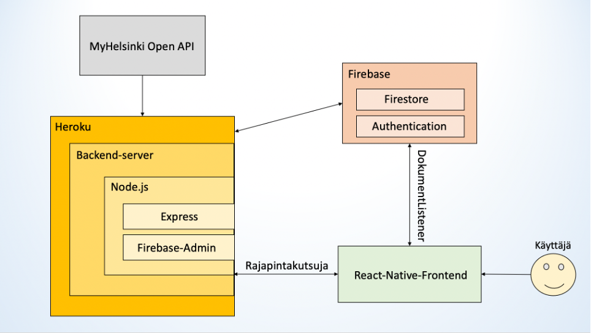

  <h1 align="center">MeetHub</h1>

  <p align="center">
    <br />
    <a href="https://github.com/jaanisavolainenhh/ohjelmistoprojekti2_front/issues">Report Bug</a>
    ·
    <a href="https://github.com/jaanisavolainenhh/ohjelmistoprojekti2_front/issues">Request Feature</a>
  </p>
</p>


<!-- TABLE OF CONTENTS -->
<details open="open">
  <summary>Table of Contents</summary>
  <ol>
    <li>
      <a href="#about-the-project">About The Project</a>
      <ul>
        <li><a href="#built-with">Built With</a></li>
      </ul>
      <ul>
        <li><a href="#libraries-used">Libraries used</a></li>
      </ul>
    </li>
    <li>
      <a href="#getting-started">Getting Started</a>
      <ul>
        <li><a href="#prerequisites">Prerequisites</a></li>
        <li><a href="#installation">Installation</a></li>
      </ul>
    </li>
    <li><a href="#using-the-application">Using the application</a>
      <ul>
        <li><a href="#home">Home</a></li>
        <li><a href="#chat">Chat</a></li>
        <li><a href="#swipes">Swipes</a></li>
        <li><a href="#edit-profile">Edit profile</a></li>
        <li><a href="#settings">Settings</a></li>
      </ul>
    </li>
        <li><a href="#end-points-usage-in-backend">End points usage in Backend</a>
      <ul>
        <li><a href="#authcontext">AuthContext</a></li>
        <li><a href="#carousel">Carousel</a></li>
        <li><a href="#editprofile">EditProfile</a></li>
        <li><a href="#globaalit">Globaalit</a></li>
        <li><a href="#login">Login</a></li>
        <li><a href="#matches">Matches</a></li>
        <li><a href="#myprofile">MyProfile</a></li>
        <li><a href="#navigation">Navigation</a></li>
        <li><a href="#profile">Profile</a></li>
        <li><a href="#register">Register</a></li>
        <li><a href="#settings">Settings</a></li>
        <li><a href="#sortablelist">SortableList</a></li>
        <li><a href="#swipecards">SwipeCards</a></li>
        <li><a href="#swipingpage">SwipingPage</a></li>
        <li><a href="#redux">Redux</a></li>
      </ul>
    </li>
    <li><a href="#roadmap">Roadmap</a></li>
    <li><a href="#Software-architecture">Software Architecture</a></li>
    <li><a href="#contributing">Contributing</a></li>
    <li><a href="#license">License</a></li>
    <li><a href="#contributors">Contributors</a></li>
  </ol>
</details>


<!-- ABOUT THE PROJECT -->
## About The Project

MeetHub is a team project of Haaga-Helia’s Software project II -course 2020.

MeetHub is fullstack mobile application where users can create and join different kind of events. Users can swipe public and private events that interests them the most.

With this application you can:<br>
* Join different kind of event by swiping event cards
* Create your own public/private event
*	Add event tags that interests you
*	Chat with other users from same event

REST API provided by MyHelsinki is used in this project. 
http://open-api.myhelsinki.fi/

### Built With

* [Firebase](https://firebase.google.com/)
* [Node.js](https://nodejs.org/en/)
* [React Native](https://reactnative.dev/)

### Libraries used
* [React Native Community Async Storage](https://react-native-async-storage.github.io/async-storage/docs/install/)
* [React Native Community Checkbox](https://github.com/react-native-checkbox/react-native-checkbox)
* [React Native Community DateTimePicker](https://github.com/react-native-datetimepicker/datetimepicker)
* [React Native Community Masked View](https://github.com/react-native-masked-view/masked-view#readme)
* [React Native Community Bottom-Tabs](https://reactnavigation.org/docs/bottom-tab-navigator/)
* [React Navigation Native](https://reactnavigation.org/)
* [React Navigation Stack](https://reactnavigation.org/docs/stack-navigator/)
* [Firebase](https://firebase.google.com/)
* [Geolib](https://github.com/manuelbieh/geolib#readme)
* [React Native Elements](https://reactnativeelements.com/)
* [React Native Flash Message](https://github.com/lucasferreira/react-native-flash-message#readme)
* [React Native Gesture Handler](https://docs.expo.io/versions/latest/sdk/gesture-handler/)
* [React Native Gifter Chat](https://github.com/FaridSafi/react-native-gifted-chat)
* [React Native Image Picker](https://github.com/react-native-image-picker/react-native-image-picker)
* [React Native Firebase](https://rnfirebase.io/)
* [Expo](https://docs.expo.io/)
* [Expo Location](https://docs.expo.io/versions/latest/sdk/location/)
* [Expo Splash Screen](https://github.com/expo/expo/tree/master/packages/expo-splash-screen)
* [React Native Maps](https://github.com/react-native-maps/react-native-maps)
* [React Native Radio Button Group](https://github.com/Abilashinamdar/react-native-radio-button-group#readme)
* [React Native Reanimated](https://docs.expo.io/versions/latest/sdk/reanimated/)
* [React Native Safe Area](https://reactnative.dev/docs/safeareaview)
* [React Native Safe Area Context](https://docs.expo.io/versions/latest/sdk/safe-area-context/)
* [React Native Screens](https://reactnative.dev/docs/navigation)
* [React Native Snap Carousel](https://github.com/archriss/react-native-snap-carousel)
* [React Native Sortable List](https://github.com/gitim/react-native-sortable-list)
* [React Native Stepper UI](https://github.com/danilrafiqi/react-native-stepper-ui#readme)
* [React Native Swipe Cards](https://github.com/meteor-factory/react-native-tinder-swipe-cards#readme)
* [React Native Vector Icons](https://github.com/oblador/react-native-vector-icons#installation)
* [React Redux](https://redux.js.org/)
* [RN Range Slider](https://github.com/githuboftigran/rn-range-slider)

<!-- GETTING STARTED -->
## Getting Started

This is an example of how you may give instructions on setting up your project locally.
To get a local copy up and running follow these simple example steps.

### Prerequisites

This is an example of how to list things you need to use the software and how to install them.
* npm
  ```sh
  npm install npm@latest -g
  ```

### Installation

1. Make folder for the project
   ```sh
   $ mkdir <Folder name>
   ```
2. Git clone both repositories to the folder
   ```sh
   $ git clone https://github.com/jaanisavolainenhh/ohjelmistoprojekti2_front.git
   $ git clone https://github.com/jaanisavolainenhh/ohjelmistoprojekti2_back.git

   ```
3. Install NPM packages to both repository folders
   ```sh
   $ cd ohjelmistoprojekti2_front && npm install
   $ cd ohjelmistoprojekti2_back && npm install

   ```


## Using the application

<h3>Matches</h3>
In Matches screen user can see events that he/she has swiped right on Swipes screen.
User can also see his/her own made events.
User can go to chat with other users that are going to the same events.

<h3>Chat</h3>
In Chat screen user can write messages with other users that are going to the same events.

<h3>Swipes</h3>
In Swipes screen there is event cards that user can swipe. If user wants to go to the event, then he/she has to swipe right and if user is not interested then he/she has to swipe left. <br><br>

User can also choose what kind of events he/she wants to go.<br><br>
User can choose to go Open, Public or Private events.<br><br>
Public events are events that anyone can join, and private events are events that user himself/herself has done and can choose who can join to their private events.

<h3>Edit profile</h3>
In Edit profile screen user can choose his/her own profile picture, write to the bio what kind of person he/she is and add tags for what kind of activities/events he/she is interested in.

<h3>Settings</h3>
In Settings screen user can choose what kind of person he/she is interested in.

## End points usage in Backend

## ohjelmistoprojekti2_front

## End points in Backend
Endpoint | Input | Output | Description
------------ | ------------- |  ------------- | -------------
message (post) | input| Output | User sends a message to another user or event
swipe (post) | input| Output | User swipes to another user or event, or event swipes to another user.
findSwipeables (post) | input| Output | Finds swipeables based on your filters and location.
register (post) | input| Output | Registers user for application
removeMatch (post) | input| Output | Removes target match from matches
resetData (post) | input| Output | resets database data and creates dummy data from existing users
profileUpdate (post) | input| Output | User can update own profile
filtersUpdate (post) | input| Output | User can update own filters
event (post) | input| Output | User create a new event
event (put) | input| Output | User updates a existing event
updateLocation (post) | input| Output | User updates users location.
opentest (post) | input| Output | Endpoint to manually get/update helsinki open api events

Props | Type | Optional | Description
------------ | ------------- |  ------------- | -------------

### Add_Event
Function | Input | Output | Description
------------ | ------------- |  ------------- | -------------
sendEvent() | date(date), eventName(String), desccription(String), tags(Array) | - | POST - user created event based on user inputs.
fetchAddress() | latitude, longitude | - | Fetches address information based on location coordinates, sets Address to be city and street for given coordinates.
fethcCoordinates() | newAddress(String) | - | Updates marker on the map view to show newly searched location and updates Address to be latest selected location.
showInvalid() | msg(String) | - | User will be prompted with invalid input indicator if event validation criterias are not fullfilled.
showSuccess() | - | - | Green indicator message for successfully created event.
showFail() | - | - | Red indicator message to let user know that the event creation failed.

### AuthContext
AuthContext allows access to SignIn() and SignOut() functions from Navigation.js to other components.

### Carousel
Component to display profile photos in scrollable "carousel" view

### Chat
Function | Input | Output | Description
------------ | ------------- |  ------------- | -------------
MessageToFirebase() | msg(Obj) | - | POST - latest message to firebase.
getConversationsRealTime() | - | messages(Array) | Fetches and creates array including all of the messages from the conversation. Also sorts them according sender to which side are rendered.
onSend() | messages(Array) | messages(Array) | Appends messages array by latest messages and updates GiftedChat to render newest message.


### EditProfile
Edit profile page shows users information: name, age, bio, tags and pictures. You can change bio and tags and the order of the images. First image is showing as your avatar to other users.
Function | Input | Output | Description
------------ | ------------- |  ------------- | -------------
getData() | - | - | Fetches user's settings from firebase
saveData() | - | - | Posts user's settings. Fires every time screen goes out of focus.
callBack() | childData (Array) | - | Callback is used for updating data from Sortablelist. When the order of images in Sortablelist change, callBack sends this information to the Edit profile page
CreateSortableList() | - | SortableList-component | This function gets fresh data to Sortablelist

# Globaalit
Firebase configuration reference

### Login
Login page where you can login or go to Register to registeras a new user.
Function | Input | Output | Description
------------ | ------------- |  ------------- | -------------
signIn() | email (String), password (String) | - | Check Navigation for more info

### Matches
Function | Input | Output | Description
------------ | ------------- |  ------------- | -------------

### MyProfile
MyProfile shows your name, age and avatar. Here you can move to Settings or Edit profile page, upload a new picture (not currently working) or move to create a new event.
Function | Input | Output | Description
------------ | ------------- |  ------------- | -------------
getData() | - | - | Fetches user's information: age, name and avatar picture from firebase. Fires every time screen becomes focused.

### Navigation
Handles authentication and different navigation views based on login status.
Function | Input | Output | Description
------------ | ------------- |  ------------- | -------------
signIn() | email (String), password (String) | - | Starts login() with given email and password. If login is successful, saves email and password to AsyncStorage and switches login page to apps content
signOut() | - | - | Signs user out, removes email and password from AsyncStorage and switches apps content to login page
loginOnStartup() | - | - | When the app open, starts signIn() if email and password is saved to AsyncStorage
login() | email (String), password (String) | String | Tries to login to firebase using given email and password. Returns error string if email or password were wrong or access to location was denied, otherwise returns success string
UpdateLocation() | - | String | Asks premission to users location and send location object to UpdateFirebase(). Returns confirmation or denial string depending if access was granted
UpdateFirebase() | location (object) | - | Send users location to firebase. Location object has latitude and longitude attributes

### Profile
Function | Input | Output | Description
------------ | ------------- |  ------------- | -------------
getProfileInformation() |   |   |   Fetches current profiles informations: Profile information, event information and event particiapiants
getUser() | user (String) | |  Fetches users profile data.
getEvent() |  | |  Fetches events profile data using route params userMatchProfile parameter
getPeopleWhoWantToJoin() | | | Fetches users that have swiped yes to event but are not swiped by event. Only called when profile type is event.
getParticipiants() | | | Fetches users that are participiating to event. Only callen when profile type is event
Accept() | accepted (boolean), uid (String) | | TBD: Function should swipe yes/no to user based on boolean as a event.
Kick() | uid (String) | | TBD: Function unmatches target user with currently selected event.
removeMatch() | target(String) , myUID(String) |  | Removes match (person-person match)

### Register
Registering page for new users.
Function | Input | Output | Description
------------ | ------------- |  ------------- | -------------
signIn() | email (String), password (String) | - | Check Navigation for more info
inputChanged() | inputName (String), inputValue (any) | - | Updates userdata states attributes with given intups. inputName is the name of the attribute you want to upadate and inputValue is the value
genderConvert() | value (int) | - | Converts ButtonGroups selected buttons index to corresponding gender value and updates userdata states gender
changePasswordVisibility() | - | - | Shows or hides password fields input
registerUser() | - | - | Tries to register new user. If registration is successful, signs new user in
validation() | - | boolean | Validates if password, age and username is within given limits. Returns true if everyting is correct

### Settings
Settings page shows your filters for swipeable users and events in Swiping page. You can filter age, distance, gender and time and choose tags as filters. 
Function | Input | Output | Description
------------ | ------------- |  ------------- | -------------
getData() | - | - | Fetches user's settings from firebase.
saveData() | - | - | Posts user's settings. Fires every time screen goes out of focus.
updateIndex() | name (String), value (int) | - | Updates selected ButtonGroups indexes to state. name refers to which ButtonGroups button was pressed (main or sub) and value is the index

### SortableList
Function | Input | Output | Description
------------ | ------------- |  ------------- | -------------

### SwipeCards
Swipe cards is a card component which contains information about other users and events
Function | Input | Output | Description
------------ | ------------- |  ------------- | -------------
timeUntillEvent() | - | String | Check Navigation for more info
calculateDistance() | - | int | Calculate the time when event is starting from now
separatedTags() | - | any | Returns tags in more displayable form for the card
handleYup() | card(any)  | boolean | User swipes card to the right and triggers PostSwipe() 
handleNope() | card(any) | boolean | User swipes card to the left and triggers PostSwipe() 
PostSwipe() | liked(any), user(any) | - | Posts swiping result to backend, params swipe directions and user id

### SwipingPage
Swiping page shows users and event you can match with by swiping left or right. You can filter if you want to be shown users, events or both and what types of events you want to see. Pressing the info button you will be redirected to the users or events profile.
Function | Input | Output | Description
------------ | ------------- |  ------------- | -------------
fetchSwipeablesFromBackend() | - | - | Fetches all swipeables users and events from firebase based on users settings (gender, tags)
updateIndex() | name (String), value (int) | - | Updates selected ButtonGroups indexes to state. name refers to which ButtonGroups button was pressed (main or sub) and value is the index
filterSwipes() | - | - | Filters users and events shown on SwipeCards based on selected ButtonGroups filters

### Redux
Redux handles data that should be accessable everywhere
Reducer   |  Description
--------  | -------------
UserDataReducer | Includes user's id, token and coordinates
DefaultReducer | Includes heroku url + other possible global type variables


<!-- ROADMAP -->
## Roadmap

See the [open issues](https://github.com/jaanisavolainenhh/ohjelmistoprojekti2_front/issues) for a list of proposed features (and known issues).

<!-- Software architecture -->
## Software architecture

MeetHub projects' software architecture



<!-- CONTRIBUTING -->
## Contributing

1. Fork the Project
2. Create your Feature Branch (`git checkout -b feature/AmazingFeature`)
3. Commit your Changes (`git commit -m 'Add some AmazingFeature'`)
4. Push to the Branch (`git push origin feature/AmazingFeature`)
5. Open a Pull Request


<!-- LICENSE -->
## License

Distributed under the MIT License. See `LICENSE` for more information.

<!-- CONTRIBUTORS -->
## Contributors

* [Sang Pham](https://github.com/Chuaaang)
* [Elina Piispanen](https://github.com/elinapiispanen)
* [Jussi Salmela](https://github.com/JussiSal)
* [Jaani Savolainen](https://github.com/jaanisavolainen)
* [Joel Vaarala](https://github.com/JoelVaarala)
