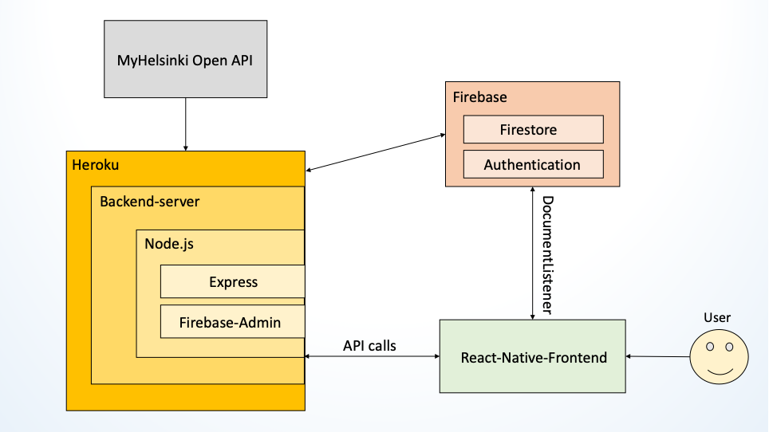

  <h3 align="center">MeetHub</h3>

  <p align="center">
    <br />
    <a href="https://github.com/jaanisavolainenhh/ohjelmistoprojekti2_front/issues">Report Bug</a>
    ·
    <a href="https://github.com/jaanisavolainenhh/ohjelmistoprojekti2_front/issues">Request Feature</a>
  </p>
</p>


<!-- TABLE OF CONTENTS -->
<details open="open">
  <summary>Table of Contents</summary>
  <ol>
    <li>
      <a href="#about-the-project">About The Project</a>
      <ul>
        <li><a href="#built-with">Built With</a></li>
      </ul>
      <ul>
        <li><a href="#libraries-used">Libraries used</a></li>
      </ul>
    </li>
    <li>
      <a href="#getting-started">Getting Started</a>
      <ul>
        <li><a href="#prerequisites">Prerequisites</a></li>
        <li><a href="#installation">Installation</a></li>
      </ul>
    </li>
    <li><a href="#usage">Using the application</a>
      <ul>
        <li><a href="#home">Home</a></li>
        <li><a href="#chat">Chat</a></li>
        <li><a href="#swipes">Swipes</a></li>
        <li><a href="#edit-profile">Edit profile</a></li>
        <li><a href="#settings">Settings</a></li>
      </ul>
    </li>
    <li><a href="#roadmap">Roadmap</a></li>
    <li><a href="#ci-pipeline">Project CI Pipeline</a></li>
    <li><a href="#contributing">Contributing</a></li>
    <li><a href="#license">License</a></li>
    <li><a href="#contributors">Contributors</a></li>
  </ol>
</details>


<!-- ABOUT THE PROJECT -->
## About The Project

MeetHub is a team project of Haaga-Helia’s Software project II -course 2020.

MeetHub is fullstack mobile application where users can create and join different kind of events. Users can swipe public and private events that interests them the most.

With this application you can:
•	Join different kind of event by swiping event cards
•	Create your own public/private event
•	Add event tags that interests you
•	Chat with other users from same event

REST API provided by MyHelsinki is used in this project. 
http://open-api.myhelsinki.fi/

### Built With

* [Firebase](https://firebase.google.com/)
* [Node.js](https://nodejs.org/en/)
* [React Native](https://reactnative.dev/)

### Libraries used
* [React Native Community Async Storage](https://react-native-async-storage.github.io/async-storage/docs/install/)
* [React Native Community Checkbox](https://github.com/react-native-checkbox/react-native-checkbox)
* [React Native Community DateTimePicker](https://github.com/react-native-datetimepicker/datetimepicker)
* [React Native Community Masked View](https://github.com/react-native-masked-view/masked-view#readme)
* [React Native Community Bottom-Tabs](https://reactnavigation.org/docs/bottom-tab-navigator/)
* [React Navigation Native](https://reactnavigation.org/)
* [React Navigation Stack](https://reactnavigation.org/docs/stack-navigator/)
* [Firebase](https://firebase.google.com/)
* [Geolib](https://github.com/manuelbieh/geolib#readme)
* [React Native Elements](https://reactnativeelements.com/)
* [React Native Flash Message](https://github.com/lucasferreira/react-native-flash-message#readme)
* [React Native Gesture Handler](https://docs.expo.io/versions/latest/sdk/gesture-handler/)
* [React Native Gifter Chat](https://github.com/FaridSafi/react-native-gifted-chat)
* [React Native Image Picker](https://github.com/react-native-image-picker/react-native-image-picker)
* [React Native Firebase](https://rnfirebase.io/)
* [Expo](https://docs.expo.io/)
* [Expo Location](https://docs.expo.io/versions/latest/sdk/location/)
* [Expo Splash Screen](https://github.com/expo/expo/tree/master/packages/expo-splash-screen)
* [React Native Maps](https://github.com/react-native-maps/react-native-maps)
* [React Native Radio Button Group](https://github.com/Abilashinamdar/react-native-radio-button-group#readme)
* [React Native Reanimated](https://docs.expo.io/versions/latest/sdk/reanimated/)
* [React Native Safe Area](https://reactnative.dev/docs/safeareaview)
* [React Native Safe Area Context](https://docs.expo.io/versions/latest/sdk/safe-area-context/)
* [React Native Screens](https://reactnative.dev/docs/navigation)
* [React Native Snap Carousel](https://github.com/archriss/react-native-snap-carousel)
* [React Native Sortable List](https://github.com/gitim/react-native-sortable-list)
* [React Native Stepper UI](https://github.com/danilrafiqi/react-native-stepper-ui#readme)
* [React Native Swipe Cards](https://github.com/meteor-factory/react-native-tinder-swipe-cards#readme)
* [React Native Vector Icons](https://github.com/oblador/react-native-vector-icons#installation)
* [React Redux](https://redux.js.org/)
* [RN Range Slider](https://github.com/githuboftigran/rn-range-slider)

<!-- GETTING STARTED -->
## Getting Started

This is an example of how you may give instructions on setting up your project locally.
To get a local copy up and running follow these simple example steps.

### Prerequisites

This is an example of how to list things you need to use the software and how to install them.
* npm
  ```sh
  npm install npm@latest -g
  ```

### Installation

1. 1.	Make folder for the project
   ```sh
   mkdir <Folder name>
   ```
2. Git clone both repositories to the folder
   ```sh
   git clone https://github.com/jaanisavolainenhh/ohjelmistoprojekti2_front.git
   git clone https://github.com/jaanisavolainenhh/ohjelmistoprojekti2_back.git

   ```
3. Install NPM packages to both repository folders
   ```sh
   cd ohjelmistoprojekti2_front && npm install
   cd ohjelmistoprojekti2_back && npm install

   ```


## Usage

Home
In home screen user can see events that he/she has swiped right on Swipes screen.
User can go to chat with other users that are going to the same events

Chat
In Chat screen user can write messages with other users that are going to same events.

Swipes
In Swipes screen there is event cards that user can swipe. If user wants to go to the event, then he/she has to swipe right and if user is not interested then he/she has to swipe left.

User can also choose what kind of events he/she wants to go. 
User can choose to go Open, Public or Private events.
Public events are events that anyone can join, and private events are events that user himself/herself has done and can choose who can join to their private events.

Edit profile
In Edit profile screen user can choose his/her own profile picture, write to the bio what kind of person he/she is and add tags for what kind of activities/events he/she is interested in.

Settings
In Settings screen user can choose what kind of person he/she is interested in.


<!-- ROADMAP -->
## Roadmap

See the [open issues](https://github.com/jaanisavolainenhh/ohjelmistoprojekti2_front/issues) for a list of proposed features (and known issues).

<!-- CI-Pipeline -->
## CI Pipeline

MeetHub project CI pipeline



<!-- CONTRIBUTING -->
## Contributing

1. Fork the Project
2. Create your Feature Branch (`git checkout -b feature/AmazingFeature`)
3. Commit your Changes (`git commit -m 'Add some AmazingFeature'`)
4. Push to the Branch (`git push origin feature/AmazingFeature`)
5. Open a Pull Request


<!-- LICENSE -->
## License

Distributed under the MIT License. See `LICENSE` for more information.

<!-- CONTRIBUTORS -->
## Contributors

* [Sang Pham](https://github.com/Chuaaang)
* [Elina Piispanen](https://github.com/elinapiispanen)
* [Jussi Salmela](https://github.com/JussiSal)
* [Jaani Savolainen](https://github.com/jaanisavolainen)
* [Joel Vaarala](https://github.com/JoelVaarala)
